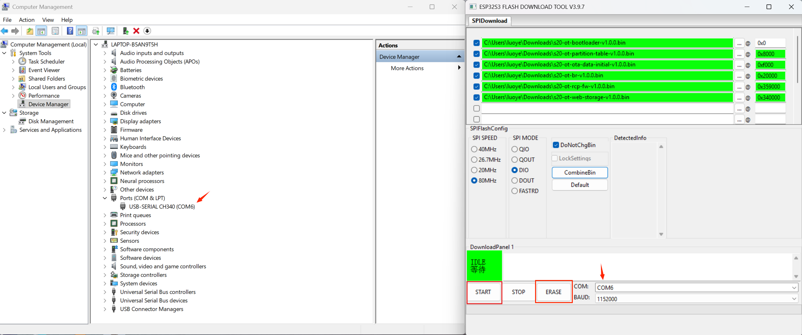
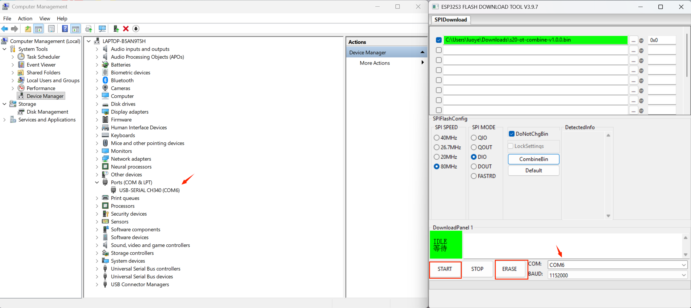

# OpenThread Border Router

## Getting start

```
$ git clone --recursive https://github.com/gl-inet/s20_thread_br_opensdk.git
$ cd s20_thread_br_opensdk/

$ git submodule update --init --recursive

### Install SDK environment
$ ./install.sh

# Active SDK environment
$. ./esp-idf/export.sh

### Build RCP
$ cd esp-idf/examples/openthread/ot_rcp/
$ idf.py --preview set-target esp32h2
$ idf.py build
$ cd -

### Build Host
$ idf.py --preview set-target esp32s3
$ idf.py build

### Flash
$ idf.py -p /dev/ttyUSB0 flash

### Monitor
$ idf.py -p /dev/ttyUSB0 monitor

### Exit monitor
Ctrl + ]
```

- **Automated build process**

```
$ ./script/ci_build

$ tree build/output/
├── list.txt
├── metadata_v1.0.0
├── s20-ot-bootloader-v1.0.0.bin
├── s20-ot-br-v1.0.0.bin
├── s20-ot-br-v1.0.0.elf
├── s20-ot-combine-v1.0.0.bin
├── s20-ot-flash-args-v1.0.0.txt
├── s20-ot-ota-data-initial-v1.0.0.bin
├── s20-ot-partition-table-v1.0.0.bin
├── s20-ot-rcp-fw-v1.0.0.bin
└── s20-ot-web-storage-v1.0.0.bin
```

The binary files will generate in `build/output`.

## Flashing by GUI tool

Click the link https://www.espressif.com/en/support/download/other-tools to download `Flash Download Tools`.

1. Extract flash_download_tool, and execute flash_download_tool.exe.


2. Select ESP32-S3,then click OK.


3. For Flash binary files, you can choose either the "Flashing multi-binary" or "Flashing combine binary" method according to your needs.

First, select serial port then erase the flash and start flashing. The flash address can be found in the file `s20-ot-flash-args-v1.0.0.txt`

- Flashing multi-binary



- Flashing combine binary



## Work with Home Assistant

### Installing the Open Thread Border Router and Thread Intergration

The Open Thread Border Router integration allows Home Assistant to acess Open Thread Border Router.

To install this integration, navigate to **Home Assistant > Settings > Devices & Services > Add Intergration** and search for **Open Thread Border Router**, submit the url like below.

`http://<YOUR_GL-S20_IP_ADDRESS>`

(replace "`<YOUR_GL-S20_IP_ADDRESS>`" with GL-S20's IP address)s

Then click **Add Intergration** again, search for **Thread**, select it and click **FINISH**, enter **Thread** Intergrations, click **CONFIGURE** and make sure you have S20‘s Thread network under **Preferred network** line, and it contains an icon with **key+phone**. If not, do the following:

Click **three dots** on the right to OpenThread Border Router, choose **Add to preferred network**.

Under the **preferred network** now, click again **three dots** on the right to OpenThread Border Router, and choose **Use router for Android + iOS credentials**.

### Installing the Matter Server Add-On and Matter Intergration

To set up Home Assistant to manage Matter devices, we need the **Matter Server** add-on.

For this, navigate to **Home Assistant > Settings > Add-Ons > Add-On Store** and search for **Matter server**, select it and follow the instructions to comple.

After the Matter server is correctly installed, navigate to **Home Assistant >** **Settings > Devices & Services > Add Integration** and search for **Matter(BETA)**.

A prompt will show up asking for a connection method. If you are working with custom containers running the Matter server, uncheck the box.

In our case, we leave it checked as the Matter server is running in Home Assistant. You will receive a **Success** message if everything is installed.

**Sync Thread Credentials**

Update Thread network credentials from Home Assistant to your phone provide to matter commissioning process.

Open Android **Companion APP > Settings > Companion app > Troubleshooting > Sync Thread credentials**.

If you get a "Added network from Home Assistant to this device", then you are good to go.

Otherwise, you will need to clear all the data of Google Play Services then try again.

### Commission End Devices

Before you start commission end devices in Home Assistant app, you need to install Google Home app in Play Store, it is recommended by Home Assistant developers and you'll not able to pair Matter over Thread devices without installed Google Home app.

To commission your device, open the Home Assistant app on your smartphone, go to **Home Assistant > Settings > Devices & Services**, in the lower tabs bar, go to **Devices** and tap on **Add Device**, tap on **Add Matter device**.

After you turn the End Devices in Commission mode, scan the Matter QR code on the End Devices.
